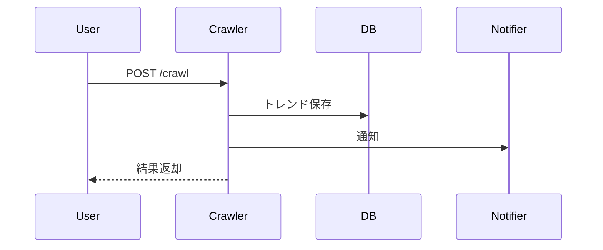
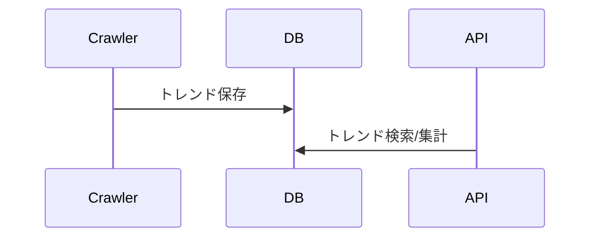
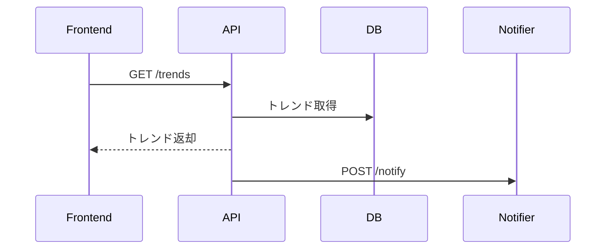
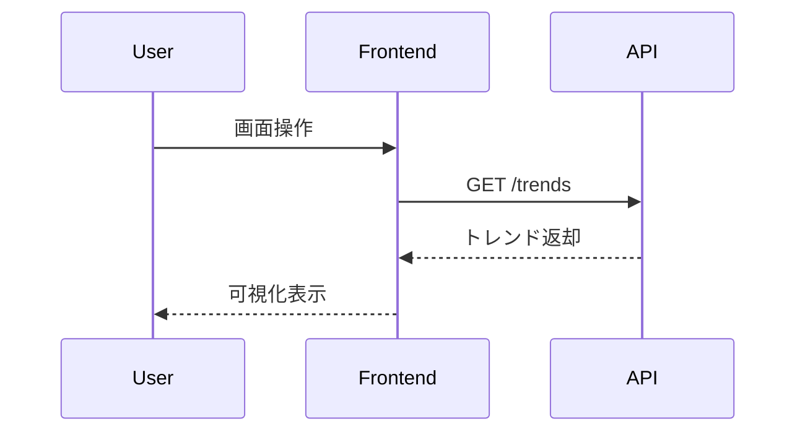
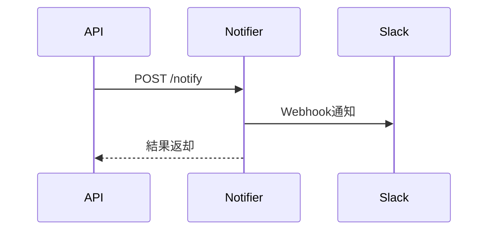

# 1. サービス分割（マイクロサービス一覧）

| サービス名    | 主な役割・技術スタック                | Docker 化 | 連携先                       |
| ------------- | ------------------------------------- | --------- | ---------------------------- |
| trend-crawler | X のトレンド収集（Python）            | 〇        | trend-db, notifier           |
| trend-db      | トレンド情報保存（NoSQL: MongoDB 等） | 〇        | 全サービス                   |
| trend-api     | トレンド情報 API（Python/FastAPI）    | 〇        | trend-db, frontend, notifier |
| frontend      | トレンド可視化 Web/モバイル（Vue+TS） | 〇        | trend-api                    |
| notifier      | Slack 通知（Python）                  | 〇        | trend-api, trend-db          |

---

# 2. サービス間連携図（テキスト）

```
+----------------+        +----------------+        +----------------+
|  trend-crawler | -----> |   trend-db     | <----- |   trend-api    |
+----------------+        +----------------+        +----------------+
         |                        ^   ^                    |
         |                        |   |                    |
         v                        |   |                    v
+----------------+                |   |            +----------------+
|   notifier     | <--------------+   +----------> |   frontend     |
+----------------+                             (API経由で可視化)
```

- trend-crawler: X API からトレンド収集 →trend-db に保存、必要に応じて notifier に通知
- trend-db: トレンド情報を NoSQL で保存
- trend-api: trend-db からデータ取得し、frontend や notifier に提供
- frontend: trend-api 経由でトレンド情報を取得し、可視化
- notifier: trend-api や trend-crawler からの指示で Slack 通知

---

# 3. 各サービスの概要・Dockerfile 設計例

## 3.1 trend-crawler（Python）

- 役割：X API からトレンド情報を定期取得し、trend-db に保存
- 連携：trend-db（MongoDB など）、notifier（Slack 通知用 API）

**Dockerfile 例**

```dockerfile
FROM python:3.11-slim
WORKDIR /app
COPY requirements.txt .
RUN pip install -r requirements.txt
COPY . .
CMD ["python", "main.py"]
```

---

## 3.2 trend-db（MongoDB）

- 役割：トレンド情報の保存
- 連携：trend-crawler, trend-api, notifier

**Dockerfile 例（公式イメージ利用）**

```dockerfile
# Dockerfileは不要、docker-composeでmongo公式イメージを指定
```

---

## 3.3 trend-api（Python/FastAPI）

- 役割：trend-db からデータ取得し、REST API で提供
- 連携：trend-db, frontend, notifier

**Dockerfile 例**

```dockerfile
FROM python:3.11-slim
WORKDIR /app
COPY requirements.txt .
RUN pip install -r requirements.txt
COPY . .
CMD ["uvicorn", "main:app", "--host", "0.0.0.0", "--port", "8000"]
```

---

## 3.4 frontend（Vue + TypeScript）

- 役割：trend-api からデータ取得し、グラフ等で可視化
- 連携：trend-api

**Dockerfile 例**

```dockerfile
FROM node:20-alpine as build
WORKDIR /app
COPY package*.json ./
RUN npm install
COPY . .
RUN npm run build

FROM nginx:alpine
COPY --from=build /app/dist /usr/share/nginx/html
EXPOSE 80
CMD ["nginx", "-g", "daemon off;"]
```

---

## 3.5 notifier（Python）

- 役割：trend-api や trend-crawler からの指示で Slack 通知
- 連携：trend-api, trend-db, Slack

**Dockerfile 例**

```dockerfile
FROM python:3.11-slim
WORKDIR /app
COPY requirements.txt .
RUN pip install -r requirements.txt
COPY . .
CMD ["python", "main.py"]
```

---

# 4. docker-compose.yml 概要例

```yaml
version: "3.8"
services:
  trend-db:
    image: mongo:6
    container_name: trend-db
    ports:
      - "27017:27017"
    volumes:
      - ./data/db:/data/db

  trend-crawler:
    build: ./trend-crawler
    depends_on:
      - trend-db
    environment:
      - MONGO_URI=mongodb://trend-db:27017

  trend-api:
    build: ./trend-api
    depends_on:
      - trend-db
    environment:
      - MONGO_URI=mongodb://trend-db:27017
    ports:
      - "8000:8000"

  frontend:
    build: ./frontend
    depends_on:
      - trend-api
    ports:
      - "8080:80"

  notifier:
    build: ./notifier
    depends_on:
      - trend-db
      - trend-api
    environment:
      - SLACK_WEBHOOK_URL=xxx
```

---

# 5. サービス連携設計まとめ

- **trend-crawler**：X API からトレンド収集 →trend-db 保存、必要に応じて notifier へ POST
- **trend-db**：MongoDB で全サービスのデータ共有
- **trend-api**：trend-db からデータ取得し REST API で提供、notifier への通知トリガーも
- **frontend**：trend-api からデータ取得し SPA で可視化
- **notifier**：trend-api や trend-crawler からのリクエストで Slack 通知

---

# 6. trend-crawler サービス詳細

## 機能仕様
- X（旧Twitter）APIからトレンド情報を定期的に取得
- trend-db（MongoDB）にトレンド情報を保存
- 収集結果やエラーをnotifierサービスに通知
- /crawlエンドポイントで手動収集も可能
- 収集対象地域や件数の指定（オプション）
- 収集ログの保存

## IF仕様
| メソッド | パス    | 内容             | リクエスト例 | レスポンス例 |
|----------|---------|------------------|--------------|--------------|
| POST     | /crawl  | トレンド収集実行 | {"region": "JP"} | {"result": "ok"} |
| GET      | /health | ヘルスチェック   | なし         | {"status": "ok"} |

## シーケンスダイアグラム


---

# 7. trend-db サービス詳細

## 機能仕様
- トレンド情報の保存・検索・集計
- trend-crawler, trend-api, notifierからの読み書き
- トレンド情報の時系列管理
- ログ・監査情報の保存

## IF仕様
| 操作         | 内容                 | リクエスト例 | レスポンス例 |
|--------------|----------------------|--------------|--------------|
| insert       | トレンド情報追加     | JSON         | Insert結果   |
| find         | トレンド情報検索     | クエリ       | JSON         |
| aggregate    | 集計                 | パイプライン | 集計結果     |

## シーケンスダイアグラム


---

# 8. trend-api サービス詳細

## 機能仕様
- trend-dbからトレンド情報を取得しREST APIで提供
- /notifyでnotifierサービスに通知
- /healthで稼働確認
- trend-dbへの新規データ追加
- トレンド情報の検索・フィルタ・集計

## IF仕様
| メソッド | パス      | 内容                 | リクエスト例 | レスポンス例 |
|----------|-----------|----------------------|--------------|--------------|
| GET      | /trends   | トレンド一覧取得     | /trends?region=JP | JSON         |
| POST     | /notify   | 通知トリガー         | {"message": "新着トレンド"} | {"result": "ok"} |
| GET      | /health   | ヘルスチェック       | なし         | {"status": "ok"} |

## シーケンスダイアグラム


---

# 9. frontend サービス詳細

## 機能仕様
- trend-apiの/trendsエンドポイントからトレンド情報を取得し、グラフやリストで可視化
- 検索・フィルタ機能
- レスポンシブUI（スマホ対応）
- エラー時の通知
- トレンドの詳細表示

## IF仕様
| 操作         | 内容                 | リクエスト例 | レスポンス例 |
|--------------|----------------------|--------------|--------------|
| fetch trends | トレンド一覧取得     | GET /trends  | JSON         |
| health check | API稼働確認          | GET /health  | {"status": "ok"} |

## シーケンスダイアグラム


---

# 10. notifier サービス詳細

## 機能仕様
- /notifyで受け取った内容をSlack WebhookにPOST
- 通知内容の整形
- /healthで稼働確認
- 通知履歴の保存（オプション）
- 通知失敗時のリトライ

## IF仕様
| メソッド | パス      | 内容                 | リクエスト例 | レスポンス例 |
|----------|-----------|----------------------|--------------|--------------|
| POST     | /notify   | Slack通知実行        | {"message": "新着トレンド"} | {"result": "ok"} |
| GET      | /health   | ヘルスチェック       | なし         | {"status": "ok"} |

## シーケンスダイアグラム


---
